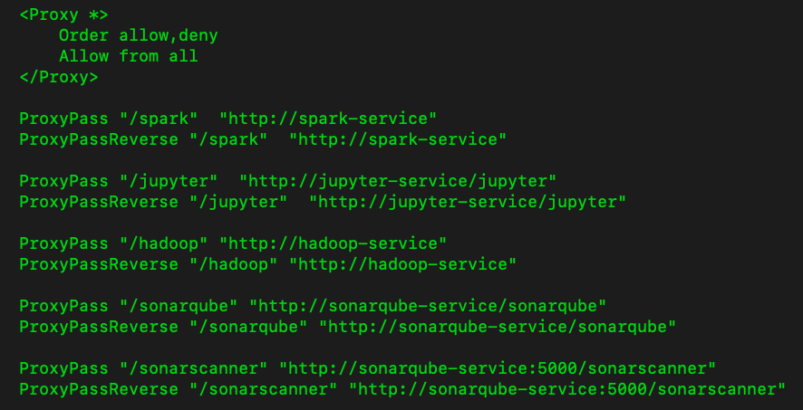

# 14848_cloud_infra_course_project_option1

## System architecture

-------

## Service
### Service Website
- Deploy Service Website to Google Cloud Platform Kubernetes Cluster
https://github.com/shihsunl/14848_cloud_infra_proj_driver

- I've used Reverse Proxy to make different url paths redirect to different services. For instance, when you use `34.135.47.138/spark`, it will redirect to `http://spark-service` which is the spark service with port 8080. You can check `https://github.com/shihsunl/14848_cloud_infra_proj_spark/blob/master/resource-manifests/service-spark.yaml` for more detail.

### Jupyter
- Deploy Jupyter to Google Cloud Platform Kubernetes Cluster
https://github.com/shihsunl/14848_cloud_infra_proj_jupyter

### Spark
- Deploy Spark to Google Cloud Platform Kubernetes Cluster
https://github.com/shihsunl/14848_cloud_infra_proj_spark

### SonarQube and SonarScanner
- Deploy SonarQube and SonarScanner to Google Cloud Platform Kubernetes Cluster
https://github.com/shihsunl/14848_cloud_infra_proj_sonarqube_sonarscanner

### Hadoop
- Deploy Hadoop to Google Cloud Platform Kubernetes Cluster
https://github.com/shihsunl/14848_cloud_infra_proj_hadoop

